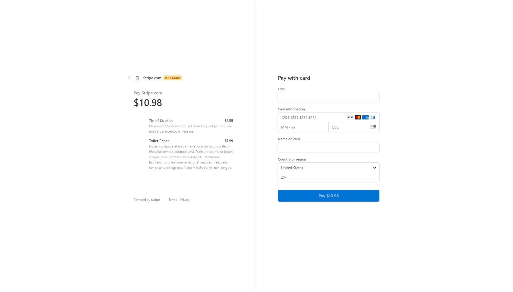

 

## **redux store** 
 

[https://obscure-reaches-85100.herokuapp.com/](https://obscure-reaches-85100.herokuapp.com/) 
 

## description

***
As a senior engineer working on an e-commerce platform I want my platform to use Redux to manage global state instead of the Context API
so that my website's state management is taken out of the React ecosystem. 
The Context API is quickly gaining traction as a worthy alternative or perhaps even successor to other libraries that manage global state in tandem with React, such as Flux or MobX. Nonetheless, the open source JavaScript library Redux remains the industry standard for managing complex state in a large-scale React application, and you’ll likely encounter it on the job. The app was created by refactoring an existing Context API code base into a Redux one. It was deployed to Heroku through MongoDB Atlas.  
 
 

## acceptance criteria

***

GIVEN an e-commerce platform that uses Redux to manage global state: 

* WHEN I review the app’s store; THEN I find that the app uses a Redux store instead of the Context API. 

* WHEN I review the way the React front end accesses the store; THEN I find that the app uses a Redux provider. 

* WHEN I review the way the app determines changes to its global state; THEN I find that the app passes reducers to a Redux store instead of using the Context API. 

* WHEN I review the way the app extracts state data from the store; THEN I find that the app uses Redux instead of the Context API. 

* WHEN I review the way the app dispatches actions; THEN I find that the app uses Redux instead of the Context API. 
 
 

## usage

***

Screenshots that shows the fully generated web pages: 
 

 
 
 

 
 
 

## some valuable references

***

These notes and links are listing some valuable references among others that I used doing this homework: 
 

[https://redux.js.org/tutorials/fundamentals/part-1-overview](https://redux.js.org/tutorials/fundamentals/part-1-overview)

[https://www.mongodb.com/cloud/atlas](https://www.mongodb.com/cloud/atlas)

[https://reactjs.org/docs/hooks-intro.html](https://reactjs.org/docs/hooks-intro.html)

[https://reactjs.org/warnings/invalid-hook-call-warning.html](https://reactjs.org/warnings/invalid-hook-call-warning.html)

[https://www.valentinog.com/blog/redux/](https://www.valentinog.com/blog/redux/)

 
 

## credits

***

Stephen Woosley - Bootcamp Instructor 
Patrick Haberern - Bootcamp TA 
Tim Nagorski - Bootcamp TA 
Sean Walmer - Bootcamp TA 
Alexis San Javier - Bootcamp Tutor 
 
 

## license

***

This is an assigment done under a bootcamp program, it is public but please contact the publisher before you use or
change any content. 
ghibli.github@gmail.com
 
 

## badges

***

 
 
